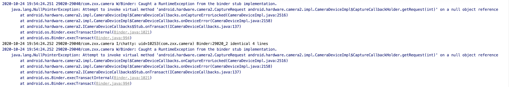

## 一.Camera2介绍

Camera2 是谷歌在Android5.0以后新增的接口，采用了新的机制，新的类进行拍照和录制。Camera2相较于Camera1增添了新的特性和功能，如

*  支持30fps全高清连拍

* 支持RAW格式的照片拍摄

Camera2是基于Pipeline，Client(也就是app)需要向相机Service发送请求，等待Service的响应。

## 二.Camera的大致拍摄和预览流程

* 从CameraService中获取到CameraManager

  ```java
  mCameraManager = (CameraManager) mActivity.getSystemService(Context.CAMERA_SERVICE);
  ```

* 从CameraManager中获取到CameraCharacteristics, 配置预览页面,然后打开相机(需要设置CameraDevice.StateCallback)

  ```java
  mCameraCharacteristics = mCameraManager.getCameraCharacteristics(Integer.toString(mCameraId));
              StreamConfigurationMap streamConfigurationMap = mCameraCharacteristics.get(CameraCharacteristics
                      .SCALER_STREAM_CONFIGURATION_MAP);
              //预览大小
              mPreviewSize = chooseOptimalSize(streamConfigurationMap.getOutputSizes(SurfaceTexture.class),width,height);
  ```

* 创建一个从Pipeline获取图片的CaptureRequest.Builder，创建Surface，并将其其设置为Target Surface

  ```java
  mPreviewRequestBuilder = mCameraDevice.createCaptureRequest(CameraDevice.TEMPLATE_PREVIEW);
  mPreviewRequestBuilder.addTarget(mPerviewSurface);
  ```

* 创建CaptureSession，并在CameraCaptureSession.StateCallback回调中生成CaptureRequest,就开始预览了，CaptureSession需要两个surface，这里我们一个用于预览，另一个ImageReader用于拍照。

  ```java
  mCameraDevice.createCaptureSession(Arrays.asList(mPerviewSurface, mImageReader.getSurface()),
                      new CameraCaptureSession.StateCallback() {
                          @Override
                          public void onConfigured(@NonNull CameraCaptureSession session) {
                              mCameraCaptureSession = session;
                              // 设置连续自动对焦
                              mPreviewRequestBuilder.set(CaptureRequest.CONTROL_AF_MODE, CaptureRequest
                                      .CONTROL_AF_MODE_CONTINUOUS_PICTURE);
                              // 设置自动曝光
                              mPreviewRequestBuilder.set(CaptureRequest.CONTROL_AE_MODE, CaptureRequest
                                      .CONTROL_AE_MODE_ON_AUTO_FLASH);
                              // 设置完后自动开始预览
                              mPreviewRequest = mPreviewRequestBuilder.build();
                              startPreview();
                          }
  
                          @Override
                          public void onConfigureFailed(@NonNull CameraCaptureSession session) {
                              Log.e(TAG, "ConfigureFailed. session: mCaptureSession");
                          }
                      }, mBackgroundHandler); // handle 传入 null 表示使用当前线程的 Looper
  ```

* 拍摄和预览过程非常类似，只要创建出和拍照对应的CaptureRequest.Builder(模版TEMPLATE_STILL_CAPTURE)，

  * 注：存储照片到相册时，系统相册可能暂时无法显示，需要重启后才会显示

## 三.Camera2的相关数据结构

### 1. CameraManager

> cameraManager是负责查询和与相机Service建立连接的功能。

* cameraManager提供了获取CameraCharacteristics实例的方法

  ``` java
  mCameraCharacteristics = mCameraManager.getCameraCharacteristics(Integer.toString(mCameraId));
  ```

* 根据指定的相机ID连接相机设备

  ``` java
  mCameraManager.openCamera(Integer.toString(mCameraId), mStateCallback, mBackgroundHandler);
  ```

### 2. CameraCharacteristics

CameraCharacteristics是封装了对应相机的基本信息，如相机的朝向``` LENS_FACING ```、

### 3. CameraDevice

CameraDevice 代表当前连接的相机设备

### 4. CameraCaptureSession

如果说CameraDevice代表当前连接的相机，那么CameraCaptureSession就是Cmaera实例和CameraService之间的桥梁。我们可以通过向CameraCaptureSession提交一个Capture请求来实现如拍照、预览、设置闪光灯模式、对焦等功能。

* 一个CameraDevice一次只能开启一个CameraCaptureSession。

CameraCaptureSession在创建Capture请求时有3种模式

* 单次模式（One-shot）
* 多次模式（Burst）注：在该模式下，不允许插入其他任何Capture请求
* 重复模式（Repeating）注：该模式的Capture是全局唯一的，也就是新提交的重复模式Capture会覆盖旧的重复模式

### 5.CaptureRequest

* CaptureRequest.builder

  ``` java
  mPreviewRequestBuilder = mCameraDevice.createCaptureRequest(CameraDevice.TEMPLATE_PREVIEW);
  ```

  通过上述方式可以来创建CaptureRequest.builder对象，该方法只有一个参数templateType用于指定使用何种模版来创建CaptureRequest.builder对象。由于Capture的可配置的参数很多，故谷歌事先配置好了一些常用的参数模版：

  * TEMPLATE_PREVIEW
  * TEMPLATE_RECORD
  * TEMPLATE_STILL_CAPTURE
  * TEMPLATE_VIDEO_SNAPSHOT
  * TEMPLATE_MANUAL

  在创建CaptureRequest的时候，必须在CaptureRequest.builder对象中配置一个Surface，且该Surface必须属于创建Session是添加的那些Surface。

  ``` java
  mPreviewRequestBuilder.addTarget(mPerviewSurface);
  ```

  在添加完一些自定义的配置后，通过``` CaptureRequest.Builder.build()``` 方法创建出一个只读的CaptureRequest实例。

* CaptureRequest

  CaptureRequest是向CameraCaptureSession提交Capture请求的载体。

  * 开始预览请求

    ```java
    mCameraCaptureSession.setRepeatingRequest(mPreviewRequestBuilder.build(),linster,mBackgroundHandler);
    ```

  * 停止预览

    ```java
    mCameraCaptureSession.stopRepeating();
    ```

  * 取消当前队列中或正在处理中的所有Capture请求

    ```java
    mCameraCaptureSession.abortCaptures();
    ```

    调用该方法能在一定程度上会加快拍照的反应速度，但这个命令在使用的过程中，或报出一些异常，可能会造成一些丢帧的情况。

    

  * 

### 6.Surface

* SurfaceView
* TextureView
* glSurfaceView

### 7.CaptureResult


​	


